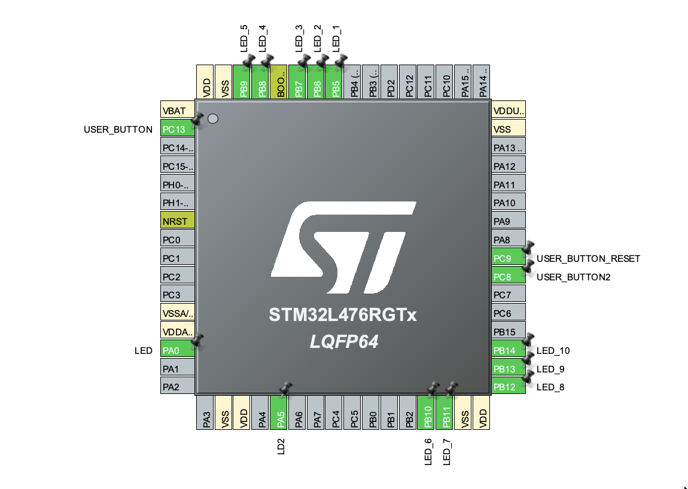
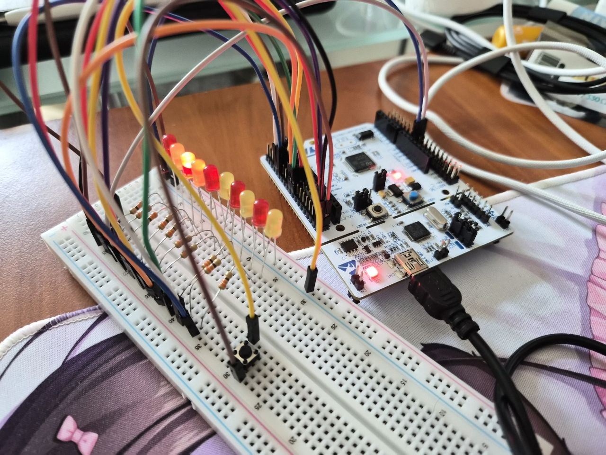

# STM32 LED Sequence Controller

STM32 project with 10 LEDs controlled by 3 buttons.

## Features
- Forward LED switching
- Backward LED switching
- Reset to initial LED
- External button support
- GPIO control with STM32 HAL

## Hardware
- STM32L476RG
- 10 LEDs
- 2 external push buttons
- 1 onboard button
- 10 × 330Ω resistors (current limiting for LEDs)

## Controls
- Onboard button → next LED
- External button 1 → previous LED
- External button 2 → reset sequence

## CubeMX Configuration

## Hardware wiring

