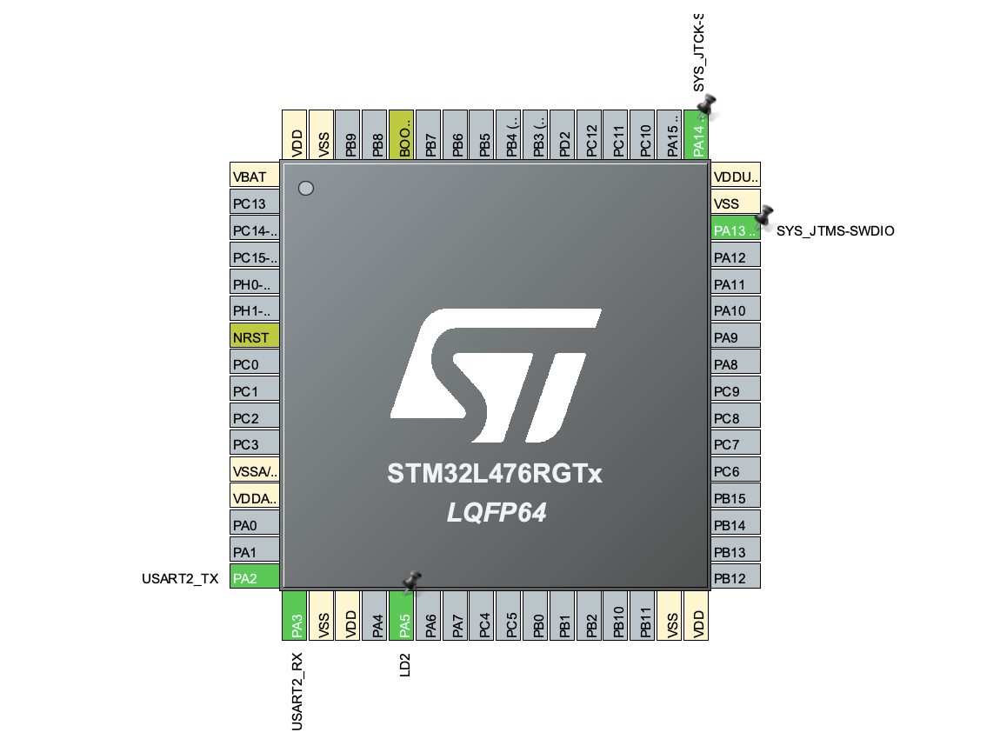

# STM32 UART LED Controller

STM32 project that controls an onboard LED using UART commands sent from a serial terminal.

## Features

- UART-based communication (USART2)
- LED ON/OFF control via text commands
- Simple command parser (line-based input)
- Serial output using `printf()`
- GPIO control with STM32 HAL

## Hardware

- STM32L476RG
- USB cable (UART via ST-Link virtual COM port)
- Onboard LED (PA5)
- USART2 interface (PA2 TX, PA3 RX)

## How to run

To open UART serial terminal, use:

```bash
screen /dev/cu.usbmodem1203 115200

## CubeMX Configuration

