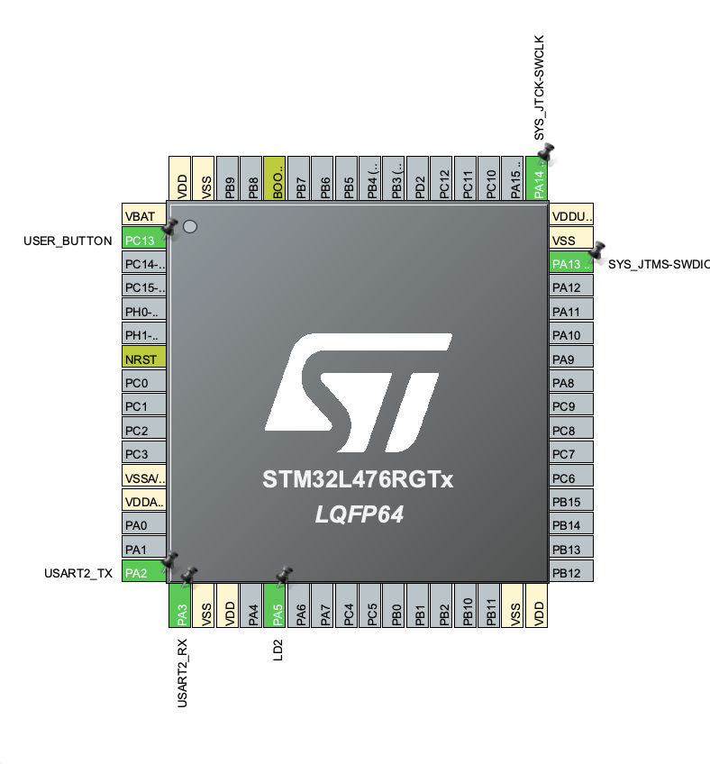

# STM32 Clock Configuration, RTC, and Watchdog

STM32 project focusing on advanced clock tree management, hardware calendar (RTC) integration, and system reliability using an independent watchdog.

## Features

- **Multi-Source Clock Tree Optimization**: Main system core speed boosted up to 80 MHz via internal PLL utilizing MSI and precise LSE autocalibration.
- **Hardware RTC (Real-Time Clock)**: Time and date tracking utilizing an external 32.768 kHz crystal oscillator (LSE) for high accuracy.
- **Independent Watchdog (IWDG)**: Automatic system hardware reset triggered upon software freeze detection (infinite stall loops).
- **Reset Cause Verification**: Distinguishing between regular power-on cycles and software-induced watchdog restarts.
- **Non-blocking Timing Architecture**: Blinking routines processed concurrently using `HAL_GetTick()` instead of blocking delays.

## Hardware

- STM32L476RG (Nucleo-L476RG board)
- Onboard User Button (PC13)
- Onboard LED (PA5)
- External LSE Quartz Crystal (32.768 kHz) for RTC

## Controls

- **Normal operation** → LED blinks at a steady 1 Hz frequency.
- **Press USER_BUTTON** → Triggers a deliberate infinite loop crash (`while(1)`).
- **Watchdog behavior** → Detects the software hangup and automatically forces a hardware reset after ~4 seconds, starting the program cycle over.

## How to run

To monitor RTC logs, time calibration, and watchdog system recovery outputs, open the UART serial terminal using:
```bash
screen /dev/cu.usbmodem11103 115200
```

## CubeMX Configuration


- **RCC**: `Low Speed Clock (LSE)` set to Crystal/Ceramic Resonator.
- **Clock Tree**: 
  - `MSI` enabled and automatically calibrated by `LSE` (error drops to 0.25%).
  - `SYSCLK` and `HCLK` configured to maximum **80 MHz** through the PLL multiplier ($MSI \times 20$).
  - `RTC/LCD Source Mux` switched to **LSE** (32.768 kHz).
- **RTC**: Activated `Clock Source` -> Internal Wakeup / Calendar.
- **IWDG**: Activated. Counter clock prescaler set to **32**, reload value set to **4095** (~4-second timeout window).


