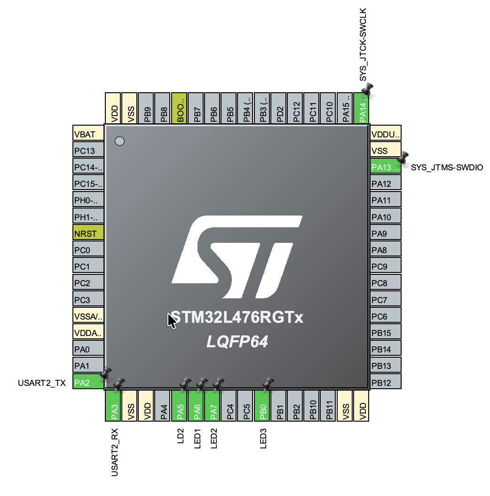
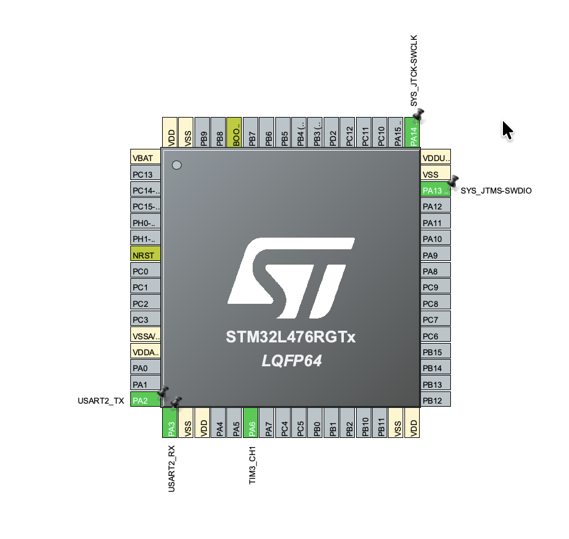
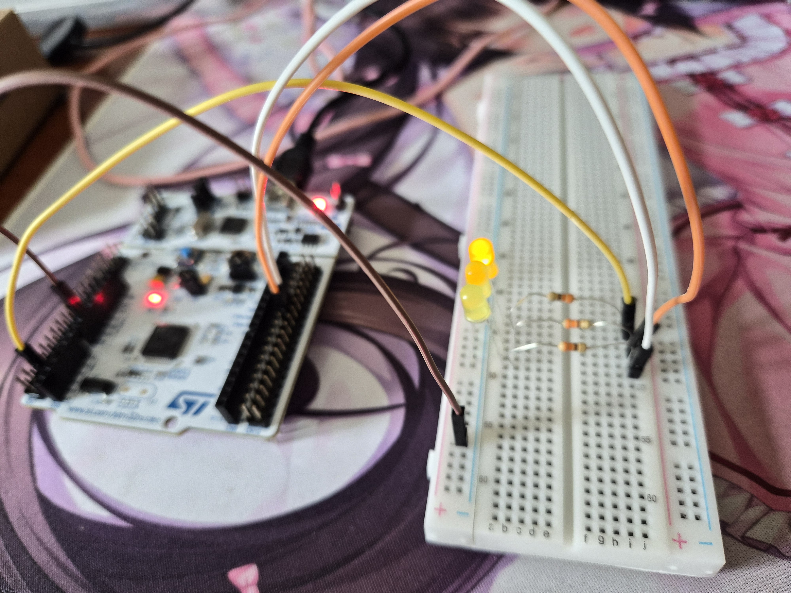

# STM32 Timers, PWM, and Rotary Encoder

STM32 project focusing on hardware timers for precise non-blocking delays, Pulse Width Modulation (PWM) for LED brightness control, and hardware-level quadrature rotary encoder decoding.

## Features

- **Hardware Timing**: Offloading periodic events and time-base tracking to hardware timers (`TIM`), freeing up main CPU execution cycles.
- **Hardware PWM Generation**: Utilizing timer capture/compare channels to generate high-frequency Pulse Width Modulation signals for smooth LED dimming.
- **Hardware Encoder Decoding**: Configuring the timer peripheral to automatically parse quadrature phase-shifted signals ($A$ and $B$) from a rotary encoder, tracking absolute rotation direction and step count in hardware.

## Hardware

- STM32L476RG (Nucleo-L476RG board)
- Onboard LED (PA5)
- LEDs (PA6, PA7, PB0)
- RGB LED
- Resistors (330Ω) and resistors(1kΩ)
- Condensator (100nF)
- Rotary Encoder with integrated push button

## Controls

- **Rotate Encoder** → Automatically updates the timer counter register via hardware, smoothly adjusting the duty cycle of the PWM signal and changing the onboard LED brightness.
- **Press Encoder Button** → Triggers an action or resets the current counter limits.

## CubeMX Configuration

- **TIM2 (PWM Mode)**: Configured in Output Compare/PWM Generation mode on the channel routed to the onboard LED. Prescaler and Auto-Reload Register (ARR) set to achieve a high-frequency flicker-free PWM signal.
- **TIM3 (Encoder Mode)**: Combined Channels configured to `Encoder Mode` (T1 and T2 tracking). Polarity and input filtering parameters set to cleanly capture quadrature phases from the physical encoder pins.

## Hardware Wiring

## Code Logic

- **Hardware-Assisted PWM**: Brightness control is offloaded directly to the timer hardware. The software only modifies the Compare Register (CCR) value to alter the duty cycle, requiring zero CPU overhead to keep the LED dimming consistent.
- **Autonomous Encoder Tracking**: The position of the rotary encoder is tracked continuously by the hardware counter of the designated timer. The code simply reads the current counter value directly from the register without needing to process rapid edge interrupts for phase shifts.

## How to run

Build and flash the project onto the board. Turn the rotary encoder knob to observe responsive, hardware-accelerated dimming of the onboard LED. The counter automatically stops or wraps around based on the defined software boundaries, showing accurate rotation tracking without missed steps.