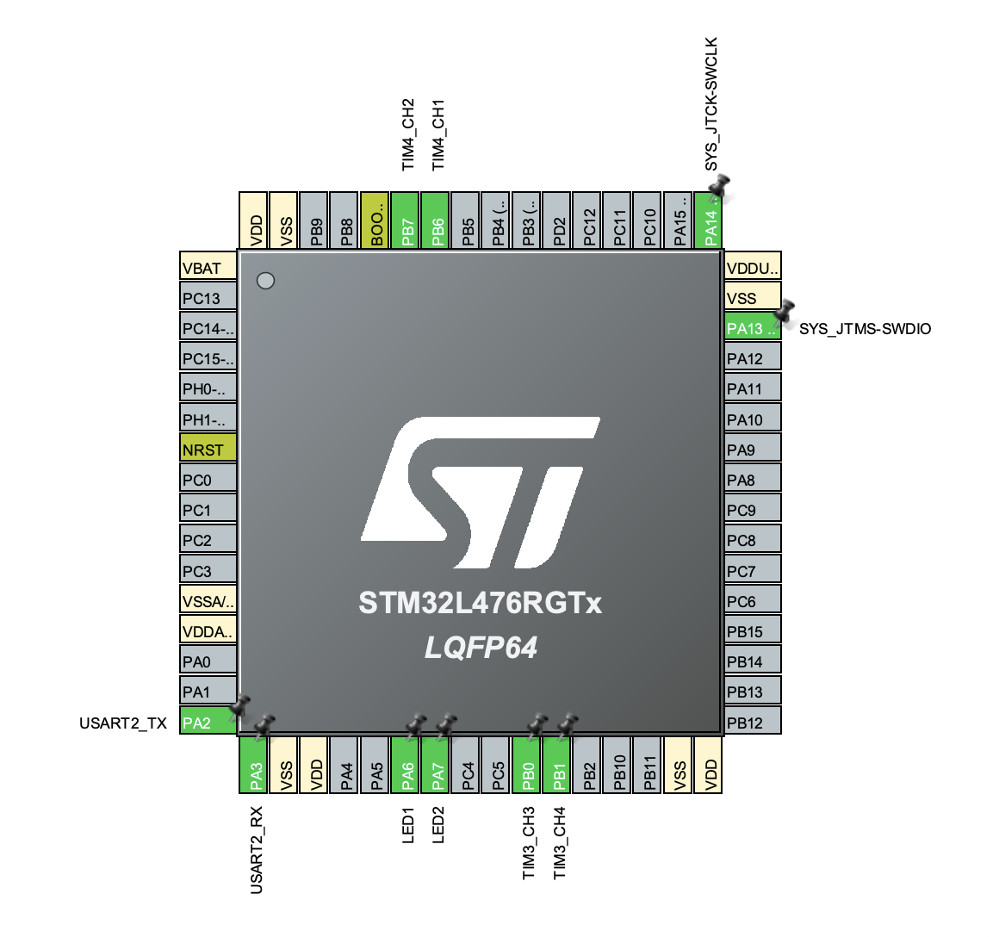
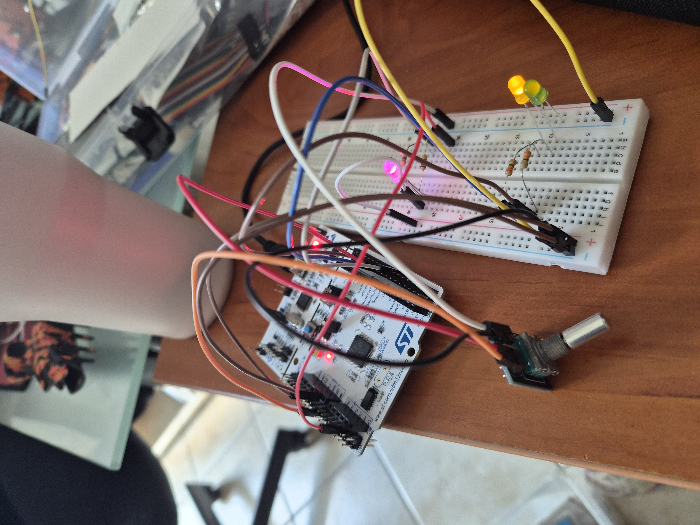

# STM32 Advanced Timers: Interrupts, PWM Siren, and Encoder

STM32 project implementing basic timer interrupts, dual-channel PWM police fading, and hardware encoder-based speed scaling.

## Hardware

- STM32L476RG (Nucleo-L476RG board)
- External Green LED
- External Yellow LED
- External RGB LED (Common Cathode/Anode)
- Rotary Encoder with an integrated push button
- 330Ω resistors (for all external LED lines)

## Features & Exercises

1. **Dual Interrupt Blinking**: `TIM6` toggles `LED1` (Green) every 2s, and `TIM7` toggles `LED2` (Yellow) every 50ms entirely inside `HAL_TIM_PeriodElapsedCallback()` via hardware interrupts.
2. **PWM Police Siren**: `TIM3` generates synchronous PWM signals on Channels 3 and 4 to smoothly cross-fade an RGB LED between its Red and Blue channels.
3. **Encoder Speed Scaling**: `TIM4` handles hardware quadrature decoding. Turning the encoder changes the siren's step interval dynamically between 20ms and 1000ms.

## CubeMX Configuration

- **TIM6 / TIM7**: Configured with a prescaler of 7999 to generate time-base updates at 2000ms ($ARR=19999$) and 50ms ($ARR=4999$) respectively.
- **TIM3**: Channels 3 and 4 enabled in `PWM Mode 1` with a period of 999 for fine-grained brightness scaling.
- **TIM4**: Configured in Encoder Mode (`TI12`) with rising edge sensitivity.

## Hardware Wiring

- **LED1 & LED2**: Connected to dedicated `GPIOA` output pins through **330Ω resistors**.
- **RGB LED**: Red and Blue elements connected via **330Ω resistors** to `TIM3` (Channel 3 and Channel 4).
- **Rotary Encoder**: Phase A and Phase B lines connected directly to `TIM4` encoder inputs.

## Code Logic

- **Blinking via Interrupts**: Toggling the green and yellow LEDs happens automatically in the background using hardware timer triggers. This ensures precise timing and leaves the main loop completely free.
- **Siren Speed Adjustment**: The main loop constantly checks if the encoder knob was turned. Rotating it updates a step counter (bounded between -100 and 100), which directly shortens or lengthens the delay between the siren's color transitions.
- **Smooth RGB Fading**: The police siren effect is created by smoothly changing the brightness of the red and blue channels. While the red light fades in, the blue light fades out at the exact same rate to ensure a seamless color swap.

## How to run

Flash the project. Verify that LED1 and LED2 pulse at their respective steady intervals. The RGB LED will transition seamlessly between red and blue. Rotate the encoder to instantly accelerate or decelerate the cycle rate.