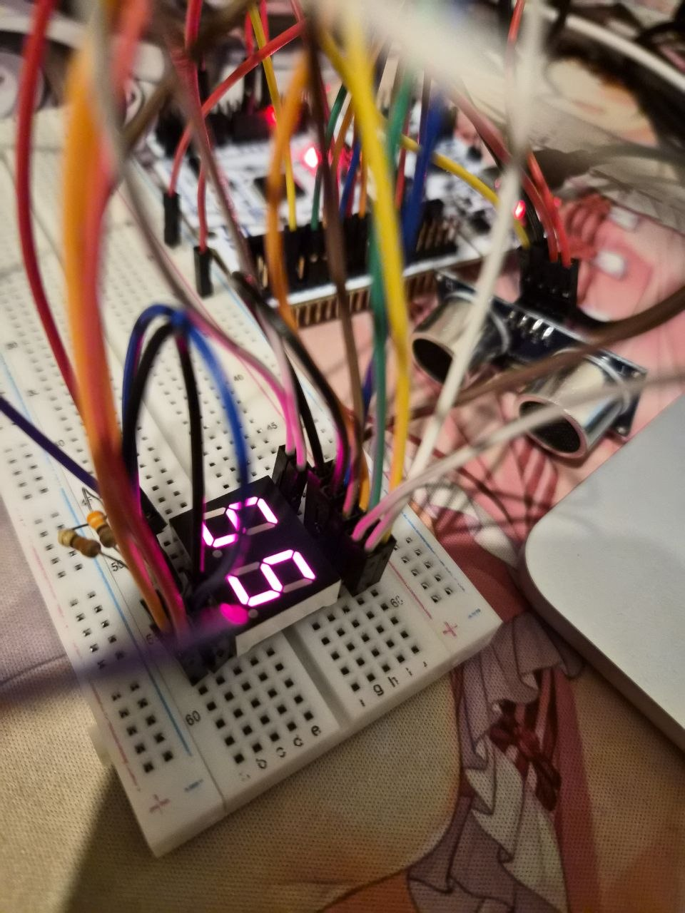
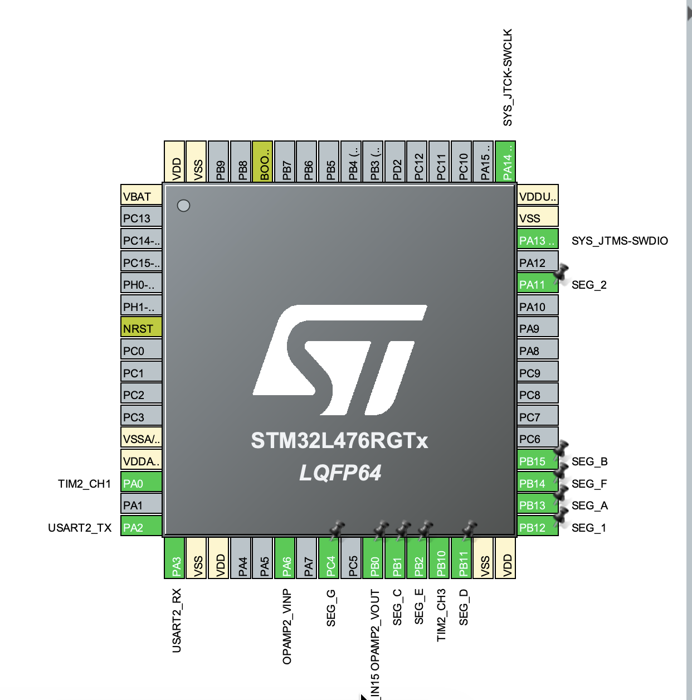

# STM32 Ultrasonic Distance Meter with 7-Segment Display

STM32 project implementing a real-time ultrasonic distance measurement system using an HC-SR04 sensor, an analog speed-of-sound calibration track, and a multiplexed dual-digit 7-segment display.

## Features & Exercises

1. **Ultrasonic Echo Capture**: Utilizing hardware timer `TIM2` in Input Capture mode to accurately track the pulse-width of the echo signal and compute physical distance.
2. **Multiplexed 7-Segment Display**: Writing a dual-digit display driver managed via `TIM6` periodic updates to continuously toggle segment cathodes in the background.
3. **Speed of Sound Calibration**: Sampling an analog voltage source using `ADC1` and utilizing the onboard operational amplifier (`OPAMP2`) to dynamically adjust the speed of sound calculation parameters.

## Hardware Setup

### Wiring Connections
- **HC-SR04 Sensor**: Trigger line connected to `TIM2` PWM output pin; Echo line routed back to `TIM2` Input Capture channel.
- **7-Segment Display**: Individual segment lines (A–G) and digit-select control pins connected directly to configured `GPIOA` / `GPIOB` GPIO pins.
- **Analog Circuitry**: Operational amplifier pins and analog voltage input line linked to `OPAMP2` and `ADC1` inputs.

## CubeMX Configuration

- **TIM2 (PWM + Input Capture)**: Channel 3 generates sensor trigger signals; Channels 1 and 2 capture the rising and falling edges of the Echo pulse.
- **TIM6 (Timebase Interrupt)**: Set up to fire periodic updates to refresh active display digits at a flicker-free frequency.
- **ADC1 & OPAMP2**: Enabled and calibrated to handle immediate analog input signal scaling.

## Code Logic

- **Asynchronous Display Multiplexing**: The `TIM6` interrupt regularly jumps into `seg7_update()`, cycling between the tens and units digit while loading the corresponding segment bitmasks.
- **Hardware Pulse Processing**: When `TIM2` records the Echo bounds, the mathematical time delta is converted into centimeters using the relation $(stop - start) / 58$ and instantly pushed to the display.
- **Continuous Environmental Tracking**: The main thread periodically reads raw values from `hadc1`, calculates voltage curves, logs real-time updates via `printf`, and optimizes parameters in the background.

## How to run

1. Flash the project to your Nucleo development board.
2. Open a serial terminal debugger set to **115200 baud** to monitor sound velocity metrics.
3. Move an object in front of the HC-SR04 sensor and observe the measured distance update live on the 7-segment display.
