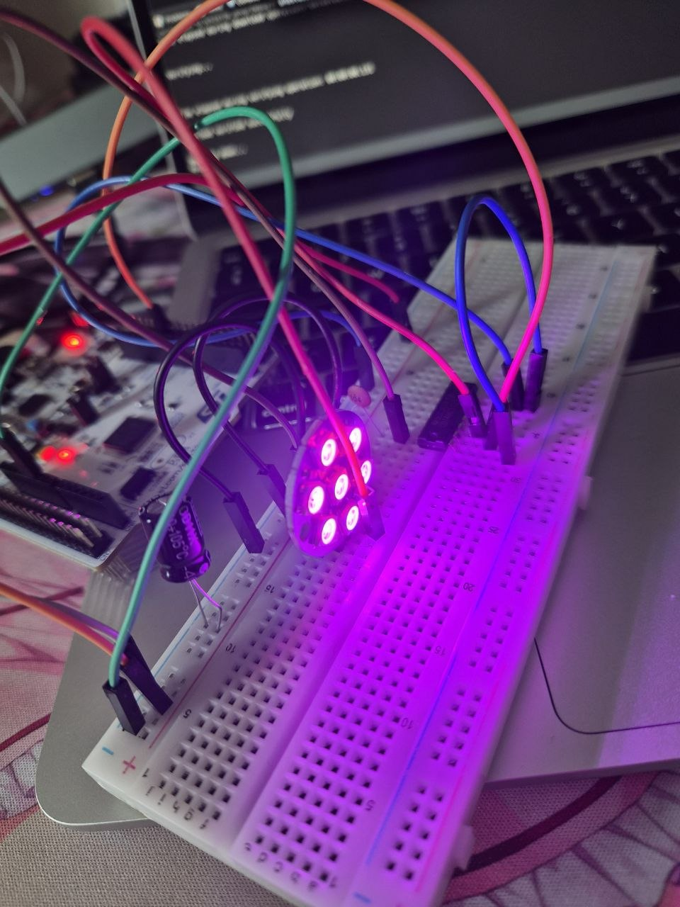
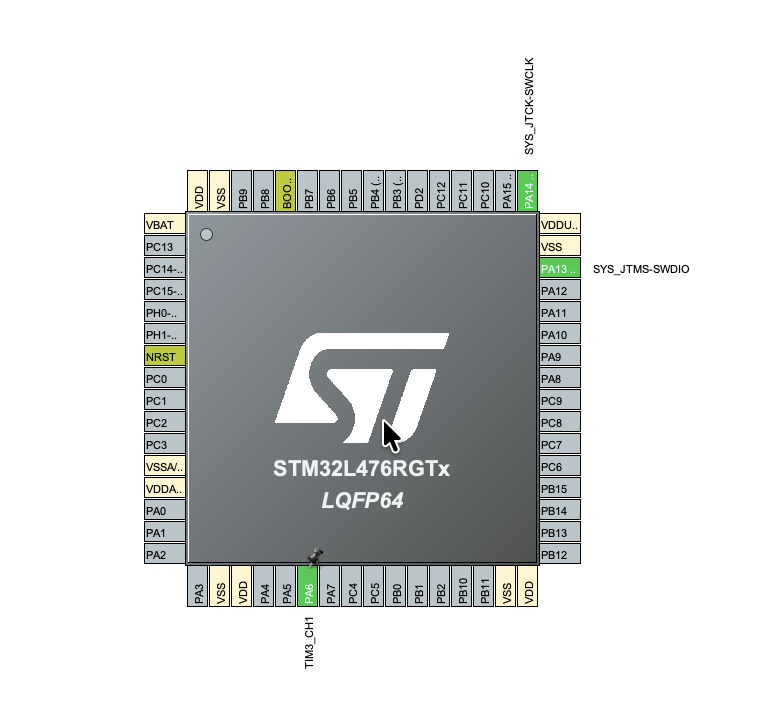

# STM32 WS2812b LED Strip Control with Gamma Correction

STM32 project implementing automated, hardware-accelerated control of an addressable WS2812b (NeoPixel) RGB LED strip using PWM generation coupled with Direct Memory Access (DMA).

## Features & Exercises

1. **WS2812b DMA Engine**: Using hardware timer `TIM3` with DMA to stream precise time-critical waveforms to the LED strip completely bypassing CPU execution loops.
2. **Gamma Correction Processing**: Implementing an 8-bit non-linear lookup table (`gamma8`) to adjust brightness levels, aligning LED outputs with human eye perception curves.
3. **Randomized Color Generation**: Automatically cycling through randomized, mathematically corrected RGB values across all connected pixels at fixed time steps.

## Hardware Setup

### Wiring Connections
- **WS2812b LED Strip**: Data Input (DI) line connected directly to the STM32 `TIM3` (Channel 1) PWM output pin.
- **Power & Grounding**: Shared common Ground (GND) across the Nucleo hardware board and the addressable LED strip power line.

## CubeMX Configuration

- **DMA Configuration**: An active memory-to-peripheral DMA channel bound to `TIM3_CH1` configured in normal/circular mode to shift array data to the peripheral automatically.

## Code Logic

- **Gamma-Corrected Colors**: The main loop uses standard random functions to request a color code, then runs it through the `gamma8` lookup table. This prevents color washing and scales brightness smoothly.
- **Protocol Buffer Mapping**: The underlying library translates traditional 8-bit color channels into long arrays of strict time-based high/low PWM durations (`BIT_0_TIME` and `BIT_1_TIME`).
- **Autonomous Strip Synchronization**: The application flushes the timing configurations into memory and invokes `HAL_TIM_PWM_Start_DMA`. The system hardware pushes the data package to the strip once every second while the CPU remains completely idle.

## How to run

1. Flash the project to your Nucleo board.
2. The system will start automatically, updating all 7 LEDs with a fresh, randomized, and visually corrected solid color every 1000 milliseconds.
