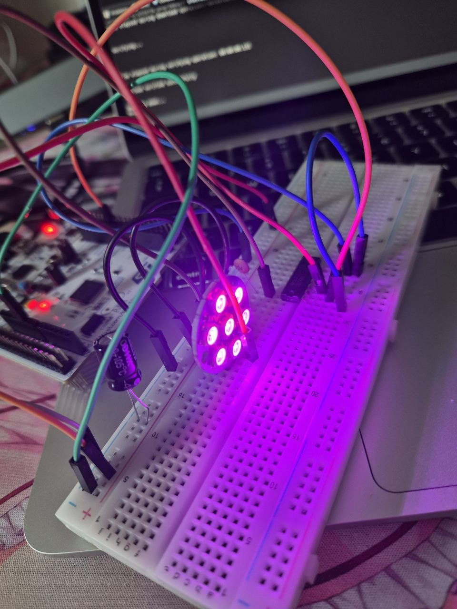
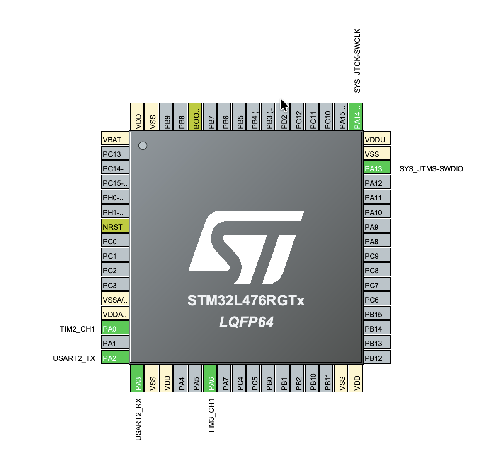

# STM32 IR Remote Controlled WS2812b LED Strip

STM32 project implementing an intelligent lighting system. The application decodes infrared (IR) signals from a remote control using the NEC standard and dynamically controls an addressable WS2812b (NeoPixel) LED strip via PWM with DMA.

## Features & Exercises

1. **NEC IR Decoding via Input Capture**: Using hardware timer `TIM2` to capture infrared pulses, decode the 32-bit data frames, and validate command integrity using complementary checksums.
2. **WS2812b Core Driver via DMA**: Utilizing `TIM3` configured in PWM mode combined with Direct Memory Access (DMA) to feed precise bit-timing waveforms to an addressable LED strip without overloading the CPU.
3. **Interactive Lighting Logic**: Processing decoded remote buttons to dynamically adjust the number of active LEDs, change structural color presets, modify stepping brightness levels, or clear the display.

## Hardware Wiring

- **IR Receiver (TSOP)**: Connected to VCC, GND, and the `TIM2` (Channel 1) input pin to capture remote controller transmissions.
- **WS2812b LED Strip**: Data input (DI) line connected directly to the `TIM3` (Channel 1) PWM output pin.
- **Power Supply**: Proper grounding across the Nucleo board, the IR receiver, and the external LED array power rail.
- **74HCT125 (Quad Buffer/Line Driver)**: A logic level shifter. Since WS2812b LEDs require a 5V logic signal to operate reliably, this IC converts the 3.3V PWM signal from the STM32 into a clean 5V logic output.
- **3 × 100nF Ceramic Capacitors**: Decoupling components that stabilize the power rail by suppressing voltage spikes caused by the rapid switching of the LEDs and integrated circuits.

## CubeMX Configuration

- **TIM2 (Input Capture)**: Configured to capture signal edge durations for software state-machine bit extraction.
- **TIM3 (PWM with DMA)**: Configured to generate precise 800 kHz bit streams, backed by a circular/normal memory-to-peripheral DMA channel to offload data transmission.
- **NVIC**: Capture interrupts enabled exclusively for `TIM2` to handle asynchronous remote inputs.

## Code Logic

- **Interrupt Bit-Shifting**: Incoming signal pulses trigger a timing classifier. Based on edge-to-edge durations, the state machine shifts logic `0` or `1` bits into an accumulator, resetting on error frames.
- **Dynamic Lighting Parameters**: The main loop parses the decoded button codes to control the state:
  - **IR_CODE_0**: Increases the active LED count (up to 7 pixels).
  - **IR_CODE_1 / 2 / 3**: Selects the base color scheme (Red, Green, or Blue).
  - **IR_CODE_4 / 6**: Dynamically scales the global brightness factor.
  - **IR_CODE_ONOFF**: Clears and shuts down the LED array.
- **Memory-Driven LED Update**: Adjusted color and brightness properties are formatted into an internal timing array buffer (`led_buffer`) and pushed instantly to the physical strip via a single non-blocking DMA transaction.

## How to run

1. Flash the project to your Nucleo board.
2. Point an NEC-compatible remote control at the IR receiver.
3. Use keys `1-3` to swap colors, `0` to add active LEDs, and `4/6` to change brightness.

### Project in Action

