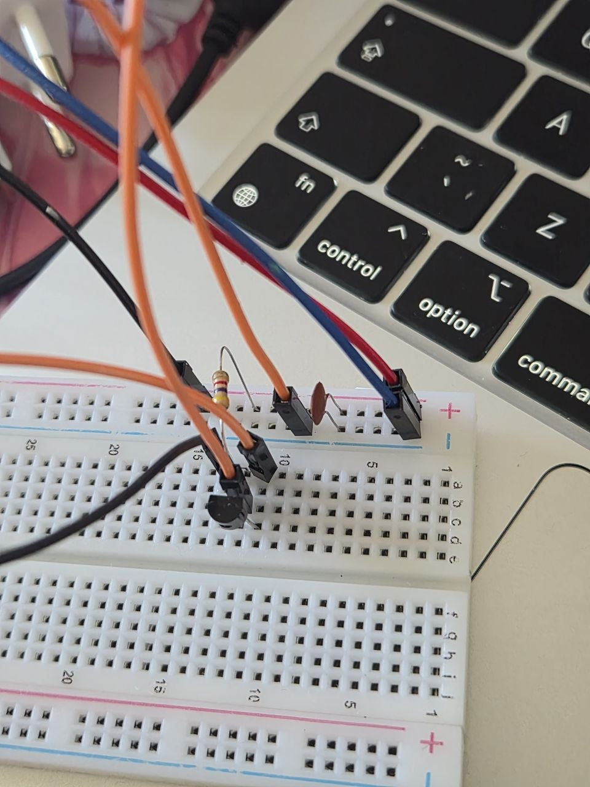
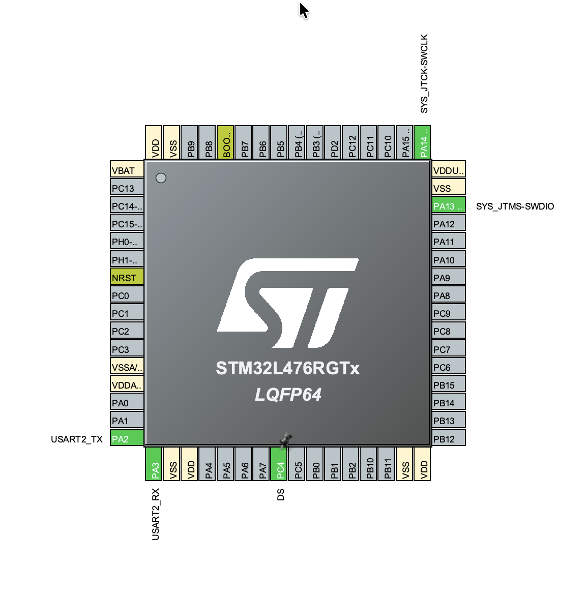

# STM32 DS18B20 1-Wire Temperature Measurement

STM32 project implementing single-bus communication with a DS18B20 digital thermometer.

## Features & Exercises

1. **Software 1-Wire Implementation**: Creating a low-level protocol driver from scratch using precise microcontroller-driven timing loops (Bit-Banging) without relying on UART hardware mapping.
2. **Single Sensor Readout**: Issuing standard 1-Wire ROM commands (`Skip ROM`) to immediately target and poll a single physical DS18B20 sensor connected to the bus.
3. **Data Parsing & Extraction**: Launching the temperature conversion cycle, polling the sensor, and processing the 12-bit binary scratchpad contents into readable Celsius degrees.

## Hardware & Wiring

- **DS18B20 Sensor**: Digital thermometer with its data line (DQ) routed to a single STM32 GPIO pin configured for bidirectional data flow.
- **4.7kΩ Pull-Up Resistor**: Placed between the DQ line and the 3.3V power supply rail to keep the open-drain 1-Wire bus properly pulled high during idle states.

## CubeMX Configuration

- **GPIO (Data Line)**: One pin selected and configured as Output Open-Drain with no internal pull-ups, allowing external control of the 1-Wire bus state.
- **Microsecond Delay Basis**: Setting up a hardware timer or utilizing system ticks to achieve the strict microsecond-level delay resolution required by the 1-Wire standard waveforms.

## Code Logic

- **Strict Bus Timings**: The code controls the bus line manually, generating the required master reset pulses ($480\mu s$), checking for the sensor's presence pulse, and sampling individual read/write time slots.
- **Skip ROM Sequence**: Since only one sensor is present on the bus, the code bypasses the complex 64-bit address matching sequence using the `0xCC` (Skip ROM) instruction, accelerating data retrieval.
- **Temperature Processing**: The application sends the convert command (`0x44`), waits for completion, reads the scratchpad bytes (`0xBE`), and converts the raw fraction bits into a real floating-point value.

## How to run

Flash the project to your Nucleo board. Open a serial terminal debugger to monitor the live logs. The application will continuously display the exact temperature readout from your single DS18B20 sensor in real-time.