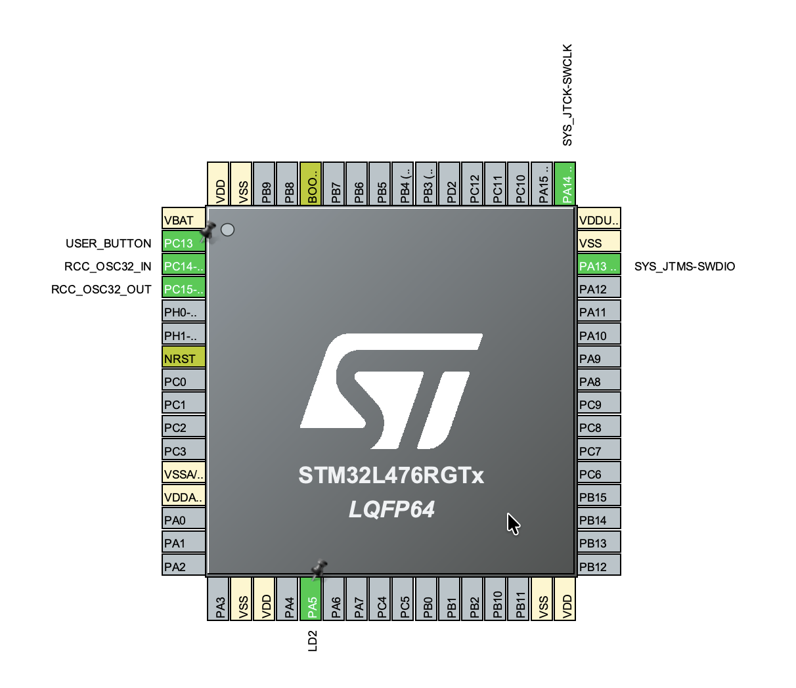
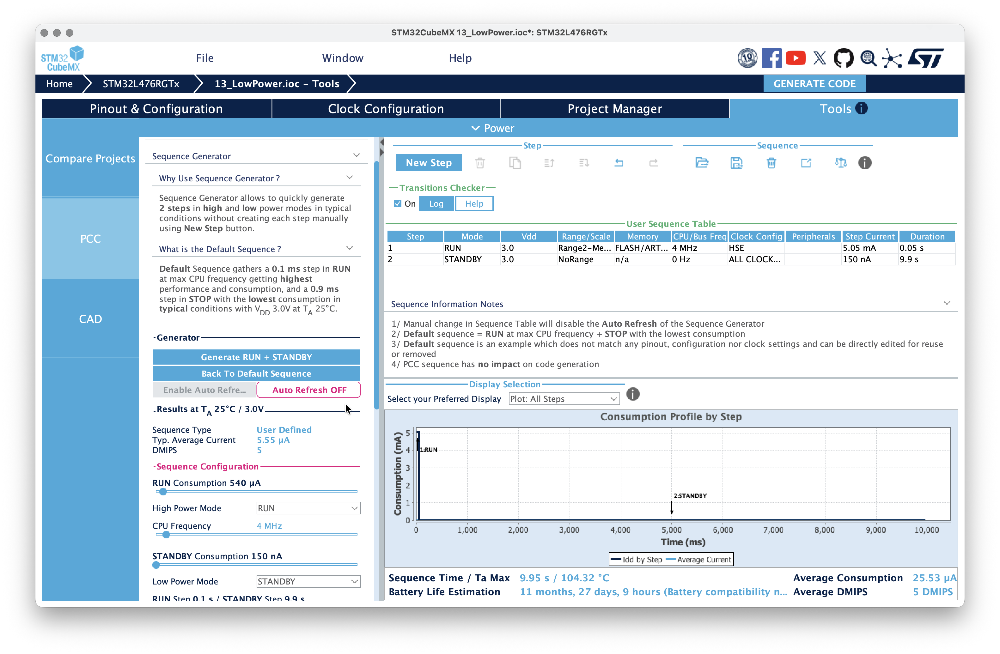

# STM32 Low-Power Modes and Power Consumption

STM32 project focusing on hardware power optimization, examining various low-power operating modes, and configuring peripherals to achieve maximum battery life.

## Features & Exercises

1. **Power Mode Exploration**: Testing and comparing standard Run mode with low-power states (Sleep, Low-Power Run, Low-Power Sleep, Stop, and Standby) to minimize current draw.
2. **Interrupt-Driven Wakeup**: Configuring external events (like a button press or an internal timer) to safely wake the microcontroller up from deep sleep states.
3. **Dynamic Clock Scaling**: Reducing the system clock frequency and disabling unused peripheral clocks to optimize energy efficiency during active computation.

## CubeMX & PCC Configuration

- **Power Calculator (PCC)**: Using the built-in STM32CubeMX Power Consumption Calculator to estimate battery life, simulate current draw, and design energy profiles.
- **System Clock**: Configured to run at a lower frequency (e.g., using the internal MSI oscillator) to significantly decrease active power draw.
- **GPIO & NVIC**: Wakeup pins configured as external interrupts (`EXTI`) with interrupt lines enabled in the controller.

## Code Logic

- **Entering Low-Power States**: The program executes specific HAL commands to put the core into Sleep or Stop modes after completing its main tasks.
- **Asynchronous Wakeup**: The MCU stays in a low-power state until a physical button press triggers an external interrupt, instantly returning the system to active Run mode.
- **Peripheral Power Management**: Unused peripherals are kept disabled, and GPIO pins are configured in analog or pull-down modes to prevent floating currents from wasting battery life.

## How to run

Flash the project. Connect an ammeter to the power jumper on the Nucleo board. Observe how the current consumption drops sharply when the MCU enters low-power modes and jumps back up when you press the button to wake it up.